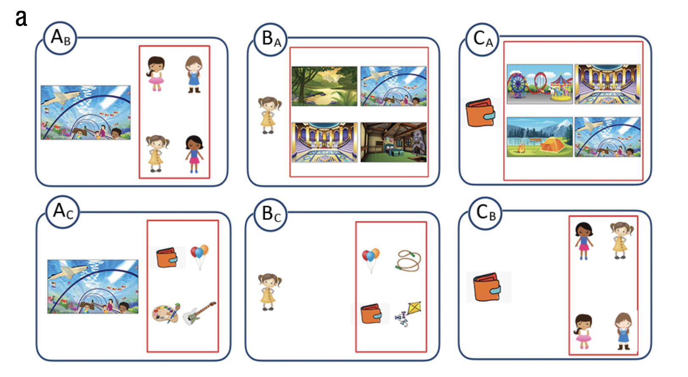
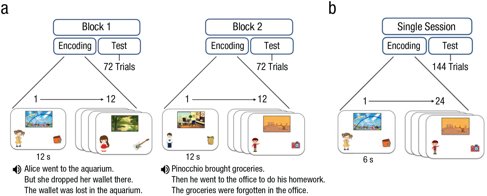
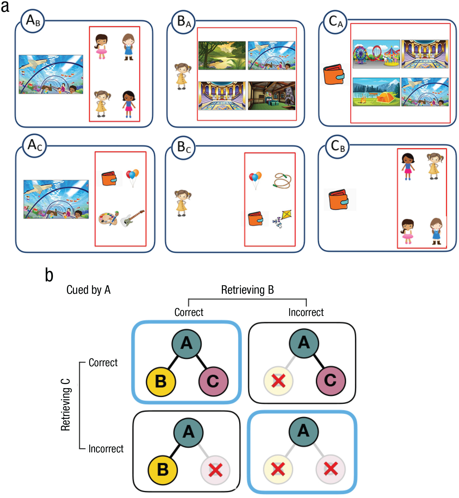

## Introduction

@ngo2019development originally investigated the ontogeny of holistic episodic memory recollection in children and younger adults. The authors sought to clarify age-dependency for memory mechanisms allowing individuals to holistically retrieve all elements of a previously encoded visual memory when presented with partial cues. This memory mechanism, generally referred to as *pattern completion*, is a neural computation supported by the hippocampus reactivating complete episodic memory representations with only a partial cue [@marr1971simple; @mcclelland1995there; @norman2003modeling]. The primary dependent variable in the original study was *retrieval dependency* (i.e., the coherence of within-event retrieval being mutually contingent: *all accurate or inaccurate*) for previously encoded multielement event stimuli each containing a scene, a person, and an object. Following the encoding phase, participants engaged in a self-paced four-alternative forced-choice cued recognition test. The retrieval dependency measure served as the index for assessing pattern completion. The authors observed retrieval dependency in all three age groups (4-year-olds, 6-year-olds, younger adults), and that retrieval dependency was disassociated from overall retrieval accuracy.

In the present replication, I aim to replicate the younger adult finding in a more diverse sample of younger adults via the Prolific online recruitment platform. This replication is important for my specific research program as I am ultimately aiming to build biologically plausible computation models of selective episodic memory retrieval mechanisms, which heavily relies on the neural computation of pattern completion in the hippocampus. Here, the same stimuli will be used with the same procedure of the original study. An example of the stimuli are presented below in Figure 1.

```{r example-stim, fig.margin=TRUE, fig.cap="Fig. 1: Example stimuli from Ngo et al. (2019).", echo=FALSE}

```

## Methods

### Links

Project repository (on Github): https://github.com/psych251/ngo2019

Original paper (as hosted in your repo): https://github.com/psych251/ngo2019/blob/main/original_paper/ngoetal2019.pdf

Experimental paradigm: https://psych.shawntylerschwartz.com/ngo

### Power Analysis

```{r}
library(pwr)

## effect sizes
d_original <- 1.32
d_large <- .80

## power levels to test
powers <- c(.80, .90, .95)

## power analyses for t-tests with effect size reported in original paper
power_80_original <- pwr.t.test(d = d_original, power = powers[1], type = "one.sample", alternative = "greater")
power_90_original <- pwr.t.test(d = d_original, power = powers[2], type = "one.sample", alternative = "greater")
power_95_original <- pwr.t.test(d = d_original, power = powers[3], type = "one.sample", alternative = "greater")

## power analyses for t-tests with relatively large effect size (to be conservative)
power_80_large <- pwr.t.test(d = d_large, power = powers[1], type = "one.sample", alternative = "greater")
power_90_large <- pwr.t.test(d = d_large, power = powers[2], type = "one.sample", alternative = "greater")
power_95_large <- pwr.t.test(d = d_large, power = powers[3], type = "one.sample", alternative = "greater")

## function to automate printing of power analysis results
print_power_results <- function(results) {
  print(paste(round(results$n), "participants will be needed to achieve", results$power, "power for an effect size of d =", results$d))
}

print_power_results(power_80_original)
print_power_results(power_90_original)
print_power_results(power_95_original)
print_power_results(power_80_large)
print_power_results(power_90_large)
print_power_results(power_95_large)
```

### Planned Sample

Based on the power analyses for a large effect size (Cohen's *d* = .80), I will collect data from 12 participants and data collection will stop once complete data from all 12 participants has been collected from Prolific. The experiment should take about 15-20 minutes to complete.

### Materials

The materials from the original article were followed precisely; they are indicated below as quoted directly from the original authors [@ngo2019development]:

'We sampled 24 cartoon images of distinct scenes (12 indoor scenes, e.g., an aquarium; 12 outdoor scenes, e.g., a playground), 24 cartoon images of common objects (e.g., a watch), and 24 images of cartoon characters from nonoverlapping movies or books (12 males, e.g., Pinocchio; 12 females, e.g., Alice) from the Google Images search engine. From this pool of selected images, we then constructed 24 “events,” each consisting of a scene (e.g., an aquarium), a person (e.g., Alice), and an object (e.g., a wallet). The event assignment of the elements was randomized, with the exception that items with preexperimental associations (e.g., books and library) were not assigned to the same event. Every possible cue–test combination of each event was tested, resulting in six test trials per event (1 = cue: scene, test: person; 2 = cue: scene, test: object; 3 = cue: person, test: scene; 4 = cue: person, test: object; 5 = cue: object, test: scene; 6 = cue: object, test: person) and totaling 144 test trials.'

### Procedure	

The procedure from the original article was originally designed for children, with modifications for a young adult manipulation. Here, I followed the original procedure for the young adults precisely. Though, the original text from the article first describes the children's version of the task and then provides the key changes for the young adult version afterward; I have taken the same approach by quoting directly the entire procedure section from the original authors [@ngo2019development]. Additionally, the original authors indicated that all participants were tested on a 13-in. laptop screen; however, given the remote nature of this study, I cannot ensure the size of screen each young adult participant will engage with the task on. I will therefore limit participants to complete this experiment on a laptop or desktop computer (i.e., no phone or tablet) to ensure maximum compatibility and relatively standard screen sizes.

'All participants were tested individually. The task procedure administered to children consisted of two encoding-test blocks, which occurred immediately after one another. Each block consisted of 12 encoding and 72 test trials, all presented on a 13-in. laptop screen. Prior to encoding, participants were told that they would see many different stories and that they should pay close attention to all of the different elements, including the scene, person, and object in each story. Then, participants viewed a series of events (12 s each; 0.5 s intertrial interval). A short audio-recorded narrative accompanied each event (e.g., “Alice went to the aquarium, but she dropped her wallet there; the wallet was lost in the aquarium”; see Fig. [2]a). Each narrative consisted of three sentences, with each sentence highlighting one pairwise association within the event. The order of the pairwise associations within each narrative was not fixed or counterbalanced across the events. The narrative was constructed this way to engage children in the task and to increase the likelihood that children would pay attention to all of the elements in an event. Prior to encoding, we provided one example (a playground, Elastigirl, a hat) in order to acquaint the participants with the encoding task.'

```{r procedure-original, fig.margin=TRUE, fig.cap='Fig. 2: "Procedure of the child (a) and adult (b) multielement-event task. In the child task, participants viewed 24 events presented in two encoding sessions, each consisting of 12 events. Each event lasted 12 s and was accompanied by an audio-recorded narrative. The test phase of each block consisted of 72 test trials. In the adult task procedure, participants studied 24 events (6 s each) together and without the recorded narrative. The test phase consisted of 144 test trials. Note that the characters shown in each event were well-known cartoon characters (e.g., Alice, Pinocchio), which have been replaced in this illustration for copyright concerns."', echo=FALSE}

```

'Immediately after the encoding phase of each block, participants performed a self-paced four-alternative forced-choice task. We tested participants on every possible cue–retrieval combination of each studied event, resulting in 6 test trials per event, which totaled 72 test trials per block. On each trial, a cue and four options were presented simultaneously on the screen (see Fig. [3]a). Among four options, one was a target—the correct item because it belonged to the same event as the cue. The three lures were same-category elements from different events. The lures always came from the events that contained same-sex characters, so that participants could not eliminate lures on the basis of general mnemonic heuristics (e.g., remembering that there was a female character who went to the aquarium). Across all 24 events, any two test trials that had overlapping cue items (e.g., AB and AC) or in which tested items (e.g., BA and CA) shared only one foil item (out of three) with respect to their event membership. For example, for the AB test trial of Event 1, the foils included the B elements from Events 2, 3, and 4, whereas for the AC trial of Event 1, the foils included the C elements from Events 3, 5, and 7 (one B and one C foil, both from Event 3). Furthermore, all items served as foils an equal number of times across all 144 test trials. Children were asked to point to one of the four options that belonged to the same story as the cue on the left side of the screen. Positions of the correct answer were counterbalanced across the entire test phase. There were no missing responses, as the response time was unrestricted. The memory task took approximately 40 min.'

```{r materials-original, fig.margin=TRUE, fig.cap='Fig. 3: "A schematic depiction of the task design and the 2 × 2 contingency table used to estimate retrieval dependency. Examples of six retrieval types per event in the test phase are shown in (a). Each element of a studied event took a turn serving as the cue (item presented on the left side of the screen) and the tested element (one of the four options presented inside the red box). The schematic (b) shows how the proportion of joint retrieval for AB and AC pairs was computed for each participant. The contingency table shows the proportion of events that fell within each of the four categories: Both AB and AC pairs were retrieved correctly, both AB and AC pairs were retrieved incorrectly, AB was retrieved correctly and AC was retrieved incorrectly, and AB was retrieved incorrectly and AC was retrieved correctly. The proportion of events in the blue-outlined boxes (both pairs correct and both pairs incorrect) were added, and the sum was divided by the total number of events. Note that the characters shown in each event were well-known cartoon characters (e.g., Alice, Pinocchio), which have been replaced in this illustration for copyright concerns."', echo=FALSE}

```

'The adult task procedure was similar to the child task procedure but with a few differences. First, the whole procedure was administered in a single session comprising 24 encoding events and 144 test trials. Second, no narratives were implemented at the encoding phase to avoid potential ceiling performance in young adults. Third, each encoding trial was presented for 6 s (see Fig. [2]b).'

### Analysis Plan

Participants will be excluded if they perform at ceiling on the memory task (i.e., with 100% accuracy).

The key analyses of interest will be first testing for *retrieval dependency* via a one-sample *t*-test to determine whether retrieval dependency (observed data – an independent model) exceeds zero. This analysis mimics the key analysis of the original study [@ngo2019development], described below by a direct quote from the original authors: 

'The retrieval dependency between retrieval successes for different associations within the same event was computed using the same methods as in previous studies [@bisby2018negative, @horner2015evidence, @horner2013associative, @horner2014pattern]. Six 2 × 2 contingency tables for the data and the predicted independent model were computed for each participant on the basis of their retrieval accuracy for each pairwise association in order to assess dependency between retrieving two elements when cued by the remaining common element within an event (ABAC; i.e., cue with A and retrieve B, and cue with A and retrieve C), and the dependency between retrieving a common item when cued by the other two elements within an event (BACA; i.e., cue with B and retrieve A, and cue with C and retrieve A). Each 2 × 2 contingency table for the data for every participant shows the proportion of events that fall within the four categories: Both AB and AC are correct or incorrect, AB is correct and AC is incorrect, and AC is correct and AB is incorrect. To examine retrieval dependency, we computed the proportion of joint retrieval for the data, defined as the proportion of events in which both associations were either correctly or incorrectly retrieved (Cells 1,1 and 2,2 of each contingency table; see Fig. [3]b). We then averaged this measure across six contingencies tables (three tables for the ABAC analysis for each element type and three tables for the BACA analysis for each element type) for each participant.'

'The independent model of retrieval estimated the degree of statistical dependency if retrieval success for specific cue–test pairs (cue: person, test: scene) was independent of retrieval success of other cue–test pairs (cue: person, test: object) in relation to participants’ overall accuracy. The independent model predicted the proportion of joint retrieval given a participant’s overall level of performance if retrievals of event pairs were independent such that the probability of the successful retrieval for both, for example, AB and AC was equal to PAB × PAC, where PAB was the probability of retrieving B when cued by A across all events, and similarly for PAC (see Fig. [4] for full details). The proportion of joint retrieval for the independent model (calculated in the same manner as described above) served as a predicted baseline for which we compared the proportion of joint retrieval in the data. Given that the proportion of joint retrieval for the data scaled with accuracy, the main index of retrieval dependency was the difference between the proportion of joint retrieval in the data and independent model for each participant—referred to as dependency. If this dependency measure (data – independent model) was significantly greater than zero, this provided evidence for significant retrieval dependency (for the same approach, see Horner & Burgess, 2013, 2014). In addition, we took the magnitude of dependency to signify the extent of holistic retrieval.'

```{r contingency-original, fig.margin=TRUE, fig.cap='Fig. 4: "Contingency table for the predicted independent model for the proportion of correct and incorrect cued recognition over the total number of events for elements B and C when cued by A. PAB denotes the probability of retrieving B when cued by A. The proportion of joint retrieval for the independent model is calculated by summing the correct-correct and the incorrect-incorrect cells and dividing by the sum of all four cells."', echo=FALSE}
knitr::include_graphics("figures/contingency.jpeg")
```

Additionally, similar to the original study, I will also check for sex differences on overall retrieval accuracy. In addition to the analyses reported in the original study, I will use a linear modeling approach to investigate whether there appears to be any age effects for retrieval accuracy and retrieval dependency. In addition to the typical frequentist statistics, Bayes factors will be reported for each analysis described above.


### Differences from Original Study

The key differences from the original study are that only young adults will be tested (not children) and a much smaller sample size of young adults (not specifically undergraduate students; *n* = 8) will be used (compared to the original *n* = 31 undergraduate students). Furthermore, I will not be having young adults participants complete a verbal intelligence task after the task. I do not anticipate these differences to make a difference on the expected results given the large effect size (Cohen's *d* = 1.32) from the original article [@ngo2019development].

<!-- ### Methods Addendum (Post Data Collection)

You can comment this section out prior to final report with data collection.

#### Actual Sample
  Sample size, demographics, data exclusions based on rules spelled out in analysis plan

#### Differences from pre-data collection methods plan
  Any differences from what was described as the original plan, or “none”. -->


## Results

### Data preparation

```{r}
## Load Relevant Libraries and Functions
library(tidyverse)
library(report)

## Import data
### get all data files from directory
data_files <- list.files(file.path("data/pilot_a"), pattern = "*.csv", full.names = TRUE)
data_files

### read individual data files to list
all_data <- lapply(data_files, read.csv)

### unpack list as singular tidy data frame
all_data <- all_data |>
  map_df(as_tibble)

## Data exclusion / filtering
### clean data into long format
all_data_cleaned <- all_data |>
  filter(!is.na(correct)) |> # pull out unnecessary rows for analysis
  separate(stimulus, into = c("root", "trialtype", "grouping"), sep = "/") |> # pull out testing category
  select(subject_id, study_id, session_id,
         trial_index, time_elapsed, rt,
         grouping, response, correct_response, correct) |> # select relevant columns
  mutate(accuracy = ifelse(correct == TRUE, 1, 0))

head(all_data_cleaned)

## Prepare data for analysis - create columns etc.
### compute individual accuracy by grouping
accuracy_summary <- all_data_cleaned |>
  group_by(grouping) |>
  summarise(mean = mean(accuracy), sd = sd(accuracy), n = n(), sem = sd/sqrt(n))

### compute overall accuracy
overall_accuracy_summary <- all_data_cleaned |>
  summarise(mean = mean(accuracy), sd = sd(accuracy), n = n(), sem = sd/sqrt(n))

### compute Ab_Ac_Accuracy
Ab_Ac_Accuracy <- all_data_cleaned |>
  filter(grouping == "Ab" | grouping == "Ac") |>
  group_by(subject_id) |>
  summarise(mean = mean(accuracy))

### compute Ba_Bc_Accuracy
Ba_Bc_Accuracy <- all_data_cleaned |>
  filter(grouping == "Ba" | grouping == "Bc") |>
  group_by(subject_id) |>
  summarise(mean = mean(accuracy))

### compute Ca_Cb_Accuracy
Ca_Cb_Accuracy <- all_data_cleaned |>
  filter(grouping == "Ca" | grouping == "Cb") |>
  group_by(subject_id) |>
  summarise(mean = mean(accuracy))

### compute Ba_Ca_Accuracy
Ba_Ca_Accuracy <- all_data_cleaned |>
  filter(grouping == "Ba" | grouping == "Ca") |>
  group_by(subject_id) |>
  summarise(mean = mean(accuracy))

### compute Ac_Bc_Accuracy
Ac_Bc_Accuracy <- all_data_cleaned |>
  filter(grouping == "Ac" | grouping == "Bc") |>
  group_by(subject_id) |>
  summarise(mean = mean(accuracy))

### compute Ab_Cb_Accuracy
Ab_Cb_Accuracy <- all_data_cleaned |>
  filter(grouping == "Ab" | grouping == "Cb") |>
  group_by(subject_id) |>
  summarise(mean = mean(accuracy))

### compute 6 2x2 contingency tables for retrieval dependency key analysis

#### define dependent model function
compute_data_model <- function(group_one, group_two, num_events = 24) {
  
  AB_one <- all_data_cleaned |>
    filter(grouping == group_one & accuracy == 1) |>
    group_by(subject_id) |>
    summarise(n = n(), proportion = n/num_events)
  
  AC_one <- all_data_cleaned |>
    filter(grouping == group_two & accuracy == 1) |>
    group_by(subject_id) |>
    summarise(n = n(), proportion = n/num_events)
  
  AB_zero <- all_data_cleaned |>
    filter(grouping == group_one & accuracy == 0) |>
    group_by(subject_id) |>
    summarise(n = n(), proportion = n/num_events)
  
  AC_zero <- all_data_cleaned |>
    filter(grouping == group_two & accuracy == 0) |>
    group_by(subject_id) |>
    summarise(n = n(), proportion = n/num_events)
  
  AB_AC_one <- AB_one$proportion * AC_one$proportion
  AB_zero_AC_zero <- AB_zero$proportion * AC_zero$proportion
  
  return(AB_AC_one + AB_zero_AC_zero)

}
#### 1) compute Data_Ab_Ac
Data_Ab_Ac <- compute_data_model("Ab", "Ac")

#### 2) compute Data_Ba_Bc
Data_Ba_Bc <- compute_data_model("Ba", "Bc")

#### 3) compute Data_Ca_Cb
Data_Ca_Cb <- compute_data_model("Ca", "Cb")

#### 4) compute Data_Ba_Ca
Data_Ba_Ca <- compute_data_model("Ba", "Ca")

#### 5) compute Data_Ac_Bc
Data_Ac_Bc <- compute_data_model("Ac", "Bc")

#### 6) compute Data_Ab_Cb
Data_Ab_Cb <- compute_data_model("Ab", "Cb")

#### define independent model function
compute_ind_model <- function(group_one, group_two) {
  P_AB <- all_data_cleaned |>
    filter(grouping == group_one) |>
    group_by(subject_id) |>
    summarise(mean = mean(accuracy))

  P_AC <- all_data_cleaned |>
    filter(grouping == group_two) |>
    group_by(subject_id) |>
    summarise(mean = mean(accuracy))

  cor_cor <- P_AB$mean * P_AC$mean
  incor_cor <- P_AC$mean * (1 - P_AB$mean)
  cor_incor <- P_AB$mean * (1 - P_AC$mean)
  incor_incor <- (1 - P_AB$mean) * (1 - P_AC$mean)

  return(cor_cor + incor_incor)
}

#### 1) compute Independent_Model_Ab_Ac
Independent_Model_Ab_Ac <- compute_ind_model("Ab", "Ac")

#### 2) compute Independent_Model_Ba_Bc
Independent_Model_Ba_Bc <- compute_ind_model("Ba", "Bc")

#### 3) compute Independent_Model_Ca_Cb
Independent_Model_Ca_Cb <- compute_ind_model("Ca", "Cb")

#### 4) compute Independent_Model_Ba_Ca
Independent_Model_Ba_Ca <- compute_ind_model("Ba", "Ca")

#### 5) compute Independent_Model_Ac_Bc
Independent_Model_Ac_Bc <- compute_ind_model("Ac", "Bc")

#### 6) compute Independent_Model_Ab_Cb
Independent_Model_Ab_Cb <- compute_ind_model("Ab", "Cb")

#### 1) compute Dependency_AbAc
Dependency_AbAc <- Data_Ab_Ac - Independent_Model_Ab_Ac

#### 2) compute Dependency_BaBc
Dependency_BaBc <- Data_Ba_Bc - Independent_Model_Ba_Bc
  
#### 3) compute Dependency_CaCb
Dependency_CaCb <- Data_Ca_Cb - Independent_Model_Ca_Cb
  
#### 4) compute Dependency_BaCa
Dependency_BaCa <- Data_Ba_Ca - Independent_Model_Ba_Ca

#### 5) compute Dependency_AcBc
Dependency_AcBc <- Data_Ac_Bc - Independent_Model_Ac_Bc
  
#### 6) compute Dependency_AbCb
Dependency_AbCb <- Data_Ab_Cb - Independent_Model_Ab_Cb

### compute Collapsed_Data
total_data_model <- (Data_Ab_Ac + Data_Ba_Bc + Data_Ca_Cb + Data_Ba_Ca + Data_Ac_Bc + Data_Ab_Cb) / 6

### compute Collapsed_Ind_Model
total_ind_model <- (Independent_Model_Ab_Ac + Independent_Model_Ba_Bc + Independent_Model_Ca_Cb + Independent_Model_Ba_Ca + Independent_Model_Ac_Bc + Independent_Model_Ab_Cb) / 6

### compute Dependency
Dependency <- total_data_model - total_ind_model
Dependency

Dependency_avg <- mean(Dependency)
Dependency_avg
```

### Confirmatory analysis
```{r}
### testing key confirmatory analysis using pilot A (n = 3) data
key_test <- t.test(Dependency, alternative = "greater", mu = 0)
report(key_test)
```


#### Overall accuracy
'Overall accuracy was defined as the proportion of target selection across 144 test trials.' [@ngo2019development]. Overall accuracy was at .XX (*SD* = .XX, 95% confidence interval (CI) = [X.XX, X.XX]).

#### Retrieval dependency
I conducted a one-sample *t*-test to determine whether dependency (data – independent model) exceeded zero for young adults, which indicated that XXX, *t*(XX) = X.XX, *p* < .XXX, *d* = X.XX, 95% CI = [X.XX, X.XX].

<!-- *Side-by-side graph with original graph is ideal here* -->

### Exploratory analyses

Coming soon...

<!-- Any follow-up analyses desired (not required). -->

## Discussion

### Summary of Replication Attempt

Open the discussion section with a paragraph summarizing the primary result from the confirmatory analysis and the assessment of whether it replicated, partially replicated, or failed to replicate the original result.  

### Commentary

Add open-ended commentary (if any) reflecting (a) insights from follow-up exploratory analysis, (b) assessment of the meaning of the replication (or not) - e.g., for a failure to replicate, are the differences between original and present study ones that definitely, plausibly, or are unlikely to have been moderators of the result, and (c) discussion of any objections or challenges raised by the current and original authors about the replication attempt.  None of these need to be long.

## References
