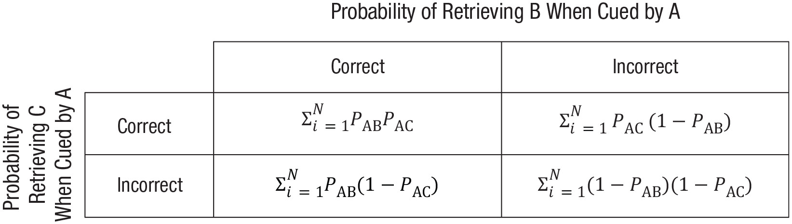

## Introduction

@ngo2019development originally investigated the ontogeny of holistic episodic memory recollection in children and younger adults. The authors sought to clarify age-dependency for memory mechanisms allowing individuals to holistically retrieve all elements of a previously encoded visual memory when presented with partial cues. This memory mechanism, generally referred to as *pattern completion*, is a neural computation supported by the hippocampus reactivating complete episodic memory representations with only a partial cue [@marr1971simple; @mcclelland1995there; @norman2003modeling]. The primary dependent variable in the original study was *retrieval dependency* (i.e., the coherence of within-event retrieval being mutually contingent: *all accurate or inaccurate*) for previously encoded multielement event stimuli each containing a scene, a person, and an object. Following the encoding phase, participants engaged in a self-paced four-alternative forced-choice cued recognition test. The retrieval dependency measure served as the index for assessing pattern completion. The authors observed retrieval dependency in all three age groups (4-year-olds, 6-year-olds, younger adults), and that retrieval dependency was disassociated from overall retrieval accuracy.

In the present replication, I aim to replicate the younger adult finding in a more diverse sample of younger adults via the Prolific online recruitment platform ([Prolific.co](https://prolific.co)). This replication is important for my specific research program as I am ultimately aiming to build biologically plausible computation models of selective episodic memory retrieval mechanisms, which heavily relies on the neural computation of pattern completion in the hippocampus. Here, the same stimuli will be used with the same procedure of the original study. An example of the stimuli are presented below in Figure 1.

```{r example-stim, fig.margin=TRUE, fig.cap="Fig. 1: Example stimuli from Ngo et al. (2019).", echo=FALSE}

```

## Methods

### Links

Project repository: https://github.com/psych251/ngo2019

Original paper: https://github.com/psych251/ngo2019/blob/main/original_paper/ngoetal2019.pdf

Experimental paradigm: https://psych.shawntylerschwartz.com/ngo

Preregistration: https://osf.io/t3rpq

### Power Analysis

```{r}
library(pwr)

## effect sizes
d_original <- 1.32
d_large <- .80

## power levels to test
powers <- c(.80, .90, .95)

## power analyses for t-tests with effect size reported in original paper
power_80_original <- pwr.t.test(d = d_original, power = powers[1], type = "one.sample", alternative = "greater")
power_90_original <- pwr.t.test(d = d_original, power = powers[2], type = "one.sample", alternative = "greater")
power_95_original <- pwr.t.test(d = d_original, power = powers[3], type = "one.sample", alternative = "greater")

## power analyses for t-tests with relatively large effect size (to be conservative)
power_80_large <- pwr.t.test(d = d_large, power = powers[1], type = "one.sample", alternative = "greater")
power_90_large <- pwr.t.test(d = d_large, power = powers[2], type = "one.sample", alternative = "greater")
power_95_large <- pwr.t.test(d = d_large, power = powers[3], type = "one.sample", alternative = "greater")

## function to automate printing of power analysis results
print_power_results <- function(results) {
  print(paste(round(results$n), "participants will be needed to achieve", results$power, "power for an effect size of d =", results$d))
}

print_power_results(power_80_original)
print_power_results(power_90_original)
print_power_results(power_95_original)
print_power_results(power_80_large)
print_power_results(power_90_large)
print_power_results(power_95_large)
```

### Planned Sample

Based on the power analyses for a large effect size (Cohen's *d* = .80), I will collect data from 12 participants and data collection will stop once complete data from all 12 participants has been collected from Prolific ([Prolific.co](https://prolific.co)). The experiment should take about 15-20 minutes to complete.

### Materials

The materials from the original article were followed precisely; they are indicated below as quoted directly from the original authors [@ngo2019development]:

'We sampled 24 cartoon images of distinct scenes (12 indoor scenes, e.g., an aquarium; 12 outdoor scenes, e.g., a playground), 24 cartoon images of common objects (e.g., a watch), and 24 images of cartoon characters from nonoverlapping movies or books (12 males, e.g., Pinocchio; 12 females, e.g., Alice) from the Google Images search engine. From this pool of selected images, we then constructed 24 “events,” each consisting of a scene (e.g., an aquarium), a person (e.g., Alice), and an object (e.g., a wallet). The event assignment of the elements was randomized, with the exception that items with preexperimental associations (e.g., books and library) were not assigned to the same event. Every possible cue–test combination of each event was tested, resulting in six test trials per event (1 = cue: scene, test: person; 2 = cue: scene, test: object; 3 = cue: person, test: scene; 4 = cue: person, test: object; 5 = cue: object, test: scene; 6 = cue: object, test: person) and totaling 144 test trials.'

### Procedure	

The procedure from the original article was originally designed for children, with modifications for a young adult manipulation. Here, I followed the original procedure for the young adults precisely. Though, the original text from the article first describes the children's version of the task and then provides the key changes for the young adult version afterward; I have taken the same approach by quoting directly the entire procedure section from the original authors [@ngo2019development]. Additionally, the original authors indicated that all participants were tested on a 13-in. laptop screen; however, given the remote nature of this study, I cannot ensure the size of screen each young adult participant will engage with the task on. I will therefore limit participants to complete this experiment on a laptop or desktop computer (i.e., no phone or tablet) to ensure maximum compatibility and relatively standard screen sizes.

'All participants were tested individually. The task procedure administered to children consisted of two encoding-test blocks, which occurred immediately after one another. Each block consisted of 12 encoding and 72 test trials, all presented on a 13-in. laptop screen. Prior to encoding, participants were told that they would see many different stories and that they should pay close attention to all of the different elements, including the scene, person, and object in each story. Then, participants viewed a series of events (12 s each; 0.5 s intertrial interval). A short audio-recorded narrative accompanied each event (e.g., “Alice went to the aquarium, but she dropped her wallet there; the wallet was lost in the aquarium”; see Fig. [2]a). Each narrative consisted of three sentences, with each sentence highlighting one pairwise association within the event. The order of the pairwise associations within each narrative was not fixed or counterbalanced across the events. The narrative was constructed this way to engage children in the task and to increase the likelihood that children would pay attention to all of the elements in an event. Prior to encoding, we provided one example (a playground, Elastigirl, a hat) in order to acquaint the participants with the encoding task.'

```{r procedure-original, fig.margin=TRUE, fig.cap='Fig. 2: "Procedure of the child (a) and adult (b) multielement-event task. In the child task, participants viewed 24 events presented in two encoding sessions, each consisting of 12 events. Each event lasted 12 s and was accompanied by an audio-recorded narrative. The test phase of each block consisted of 72 test trials. In the adult task procedure, participants studied 24 events (6 s each) together and without the recorded narrative. The test phase consisted of 144 test trials. Note that the characters shown in each event were well-known cartoon characters (e.g., Alice, Pinocchio), which have been replaced in this illustration for copyright concerns."', echo=FALSE}
knitr::include_graphics("figures/procedure.jpeg")
```

'Immediately after the encoding phase of each block, participants performed a self-paced four-alternative forced-choice task. We tested participants on every possible cue–retrieval combination of each studied event, resulting in 6 test trials per event, which totaled 72 test trials per block. On each trial, a cue and four options were presented simultaneously on the screen (see Fig. [3]a). Among four options, one was a target—the correct item because it belonged to the same event as the cue. The three lures were same-category elements from different events. The lures always came from the events that contained same-sex characters, so that participants could not eliminate lures on the basis of general mnemonic heuristics (e.g., remembering that there was a female character who went to the aquarium). Across all 24 events, any two test trials that had overlapping cue items (e.g., AB and AC) or in which tested items (e.g., BA and CA) shared only one foil item (out of three) with respect to their event membership. For example, for the AB test trial of Event 1, the foils included the B elements from Events 2, 3, and 4, whereas for the AC trial of Event 1, the foils included the C elements from Events 3, 5, and 7 (one B and one C foil, both from Event 3). Furthermore, all items served as foils an equal number of times across all 144 test trials. Children were asked to point to one of the four options that belonged to the same story as the cue on the left side of the screen. Positions of the correct answer were counterbalanced across the entire test phase. There were no missing responses, as the response time was unrestricted. The memory task took approximately 40 min.'

```{r materials-original, fig.margin=TRUE, fig.cap='Fig. 3: "A schematic depiction of the task design and the 2 × 2 contingency table used to estimate retrieval dependency. Examples of six retrieval types per event in the test phase are shown in (a). Each element of a studied event took a turn serving as the cue (item presented on the left side of the screen) and the tested element (one of the four options presented inside the red box). The schematic (b) shows how the proportion of joint retrieval for AB and AC pairs was computed for each participant. The contingency table shows the proportion of events that fell within each of the four categories: Both AB and AC pairs were retrieved correctly, both AB and AC pairs were retrieved incorrectly, AB was retrieved correctly and AC was retrieved incorrectly, and AB was retrieved incorrectly and AC was retrieved correctly. The proportion of events in the blue-outlined boxes (both pairs correct and both pairs incorrect) were added, and the sum was divided by the total number of events. Note that the characters shown in each event were well-known cartoon characters (e.g., Alice, Pinocchio), which have been replaced in this illustration for copyright concerns."', echo=FALSE}
knitr::include_graphics("figures/materials.jpeg")
```

'The adult task procedure was similar to the child task procedure but with a few differences. First, the whole procedure was administered in a single session comprising 24 encoding events and 144 test trials. Second, no narratives were implemented at the encoding phase to avoid potential ceiling performance in young adults. Third, each encoding trial was presented for 6 s (see Fig. [2]b).'

### Analysis Plan

#### Exclusion Criteria
Participants will be excluded if they perform at ceiling on the memory task (i.e., with 100% accuracy).

#### Key Analysis
The key analysis of interest will be first testing for *retrieval dependency* via a one-sample *t*-test to determine whether retrieval dependency (observed data – an independent model) exceeds zero. This analysis mimics the key analysis of the original study [@ngo2019development], described below by a direct quote from the original authors: 

'The retrieval dependency between retrieval successes for different associations within the same event was computed using the same methods as in previous studies [@bisby2018negative; @horner2015evidence; @horner2013associative; @horner2014pattern]. Six 2 × 2 contingency tables for the data and the predicted independent model were computed for each participant on the basis of their retrieval accuracy for each pairwise association in order to assess dependency between retrieving two elements when cued by the remaining common element within an event (ABAC; i.e., cue with A and retrieve B, and cue with A and retrieve C), and the dependency between retrieving a common item when cued by the other two elements within an event (BACA; i.e., cue with B and retrieve A, and cue with C and retrieve A). Each 2 × 2 contingency table for the data for every participant shows the proportion of events that fall within the four categories: Both AB and AC are correct or incorrect, AB is correct and AC is incorrect, and AC is correct and AB is incorrect. To examine retrieval dependency, we computed the proportion of joint retrieval for the data, defined as the proportion of events in which both associations were either correctly or incorrectly retrieved (Cells 1,1 and 2,2 of each contingency table; see Fig. [3]b). We then averaged this measure across six contingencies tables (three tables for the ABAC analysis for each element type and three tables for the BACA analysis for each element type) for each participant.'

'The independent model of retrieval estimated the degree of statistical dependency if retrieval success for specific cue–test pairs (cue: person, test: scene) was independent of retrieval success of other cue–test pairs (cue: person, test: object) in relation to participants’ overall accuracy. The independent model predicted the proportion of joint retrieval given a participant’s overall level of performance if retrievals of event pairs were independent such that the probability of the successful retrieval for both, for example, AB and AC was equal to PAB × PAC, where PAB was the probability of retrieving B when cued by A across all events, and similarly for PAC (see Fig. [4] for full details). The proportion of joint retrieval for the independent model (calculated in the same manner as described above) served as a predicted baseline for which we compared the proportion of joint retrieval in the data. Given that the proportion of joint retrieval for the data scaled with accuracy, the main index of retrieval dependency was the difference between the proportion of joint retrieval in the data and independent model for each participant—referred to as dependency. If this dependency measure (data – independent model) was significantly greater than zero, this provided evidence for significant retrieval dependency (for the same approach, see Horner & Burgess, 2013, 2014). In addition, we took the magnitude of dependency to signify the extent of holistic retrieval.'

```{r contingency-original, fig.margin=TRUE, fig.cap='Fig. 4: "Contingency table for the predicted independent model for the proportion of correct and incorrect cued recognition over the total number of events for elements B and C when cued by A. PAB denotes the probability of retrieving B when cued by A. The proportion of joint retrieval for the independent model is calculated by summing the correct-correct and the incorrect-incorrect cells and dividing by the sum of all four cells."', echo=FALSE}

```

#### Gender Differences and Age Effects
Additionally, similar to the original study, I will also check for gender differences on overall retrieval accuracy. In addition to the analyses reported in the original study, I will use a linear modeling approach to investigate whether there appears to be any age effects for retrieval accuracy and retrieval dependency. In addition to the typical frequentist statistics, Bayes factors will be reported for each analysis described above.

```{r}
## Load Relevant Libraries and Functions
library(tidyverse)
library(BayesFactor)

## Import data
### get all data files from directory
data_files <- list.files(file.path("data/full_run"), pattern = "*.csv", full.names = TRUE)
data_files

### read individual data files to list
all_data <- lapply(data_files, read.csv)

### unpack list as singular tidy data frame
all_data <- all_data |>
  map_df(as_tibble)
```

### Differences from Original Study

The key differences between the original study and this formally preregistered replication are that only younger adults will be tested (not children), and a much smaller sample size of younger adults (not specifically undergraduate students; *n* = 12) will be used (compared to the original *n* = 31 undergraduate students; 18 female, *M* = 20.65 years, *SD* = 3.23, range 18-31). The population in which participants will be sampled from here is [Prolific.co](https://prolific.co), and participants will be paid $3.34 for their participation. This deviates from the original study, which sampled from the undergraduate student population at Temple University, where students participated for partial course credit. In both the original study and my replication, participants will have normal or corrected-to-normal vision. Additionally, I am imposing the prescreening requirements such that the current country of residence is the United States, the minimum age for participation is 18 and the maximum age is 30 years (inclusive), and that participants' first language is English. I am also specifically targeting a 50/50 even-split between male- and female-identifying participants via Prolific's participant recruiting feature. Furthermore, I will not be having the younger adult participants complete a verbal intelligence task after the primary memory task like was done in the original study. Thus, in this replication, younger adult participants will only be completing the encoding and retrieval portion of the memory task reported on in the original published paper. I do not anticipate these variations to make a difference on the expected results given the large effect size (Cohen's *d* = 1.32) reported in the original article [@ngo2019development].

### Methods Addendum (Post-Data Collection)

```{r}
### unpack participant demographics
demographics_trials <- all_data |>
  subset(trial_type == "survey-html-form")

### string together json strings
json_text <- paste0(demographics_trials$response, collapse = ',')
json_text <- paste0('[', json_text, ']')

### unpack json as data frame
demographics_trials <- jsonlite::fromJSON(json_text) |>
  as_tibble() |>
  mutate(subject_id = rownames(demographics_trials), .before = "Gender")

### get participant demographic stats
#### age
mean_age <- mean(as.numeric(demographics_trials$Age))
sd_age <- sd(as.numeric(demographics_trials$Age))
min_age <- min(as.numeric(demographics_trials$Age))
max_age <- max(as.numeric(demographics_trials$Age))

#### gender
table(demographics_trials$Gender)
```

#### Actual Sample
The demographic composition of the participants I recruited online varied slightly from those in the original study, *n* = 12, *M* = `r mean_age` years, *SD* = `r round(sd_age, 2)`, range: `r min_age`-`r max_age`; `r table(demographics_trials$Gender)[1]` females, `r table(demographics_trials$Gender)[2]` males, and `r table(demographics_trials$Gender)[3]` individual who preferred not to answer (compared to the original *n* = 31 undergraduate students; 18 female, *M* = 20.65 years, *SD* = 3.23, range 18-31; @ngo2019development). Participants recruited via [Prolific.co](https://prolific.co) for this replication attempt were recruited with the following prescreening criteria: normal or corrected-to-normal vision, currently reside in the United States, English as the first language, ages 18-30 (inclusive), and did not participate in Pilots A or B. I used the sex-matching feature on [Prolific.co](https://prolific.co) to aim for an equal distribution of gender within the recruited online sample. Furthermore, no participants in this replication reported colorblindness, and no participants were excluded for having 100% accuracy on the 4-alternative-forced-choice cued recognition test.

#### Differences from Pre-Data Collection Methods Plan
The first difference that was not originally planned was the addition of the descriptive statistics and a plot for the proportion of joint retrieval for the data and independent models. This has been added below and the data are included with the `Retrieval Dependency` and `Overall Accuracy` boxplots below. Secondly, I have added an exploratory analysis to examine potential gender differences for retrieval dependency.


## Results

### Data Preparation

```{r}
## Data exclusion / filtering
### clean data into long format
all_data_cleaned <- all_data |>
  filter(!is.na(correct)) |> # pull out unnecessary rows for analysis
  select(subject_id, trial_index, time_elapsed, rt, stimulus, task,
         retrieval_group, response, correct_response, correct) |> # select relevant columns
  mutate(accuracy = ifelse(correct == "TRUE", 1, 0)) |>
  separate(stimulus, c(NA, NA, NA, NA, "id"), sep = "_", remove = FALSE) # get each retrieval image id independent of the cue grouping

head(all_data_cleaned)

## Prepare data for analysis - create columns etc.
### compute individual accuracy by grouping
accuracy_summary <- all_data_cleaned |>
  filter(task == "response") |> # only use retrieval data
  group_by(retrieval_group) |>
  summarise(mean = mean(accuracy), sd = sd(accuracy), n = n(), sem = sd/sqrt(n))

### compute accuracy by participant
accuracy_summary_part <- all_data_cleaned |>
  filter(task == "response") |> # only use retrieval data
  group_by(subject_id) |>
  summarise(mean = mean(accuracy), sd = sd(accuracy), n = n(), sem = sd/sqrt(n))

### compute overall accuracy
overall_accuracy_summary <- all_data_cleaned |>
  filter(task == "response") |> # only use retrieval data
  summarise(mean = mean(accuracy), sd = sd(accuracy), n = n(), sem = sd/sqrt(n))

### compute Ab_Ac_Accuracy
Ab_Ac_Accuracy <- all_data_cleaned |>
  filter(task == "response") |> # only use retrieval data
  filter(retrieval_group == "Ab" | retrieval_group == "Ac") |>
  group_by(subject_id) |>
  summarise(mean = mean(accuracy))

### compute Ba_Bc_Accuracy
Ba_Bc_Accuracy <- all_data_cleaned |>
  filter(task == "response") |> # only use retrieval data
  filter(retrieval_group == "Ba" | retrieval_group == "Bc") |>
  group_by(subject_id) |>
  summarise(mean = mean(accuracy))

### compute Ca_Cb_Accuracy
Ca_Cb_Accuracy <- all_data_cleaned |>
  filter(task == "response") |> # only use retrieval data
  filter(retrieval_group == "Ca" | retrieval_group == "Cb") |>
  group_by(subject_id) |>
  summarise(mean = mean(accuracy))

### compute Ba_Ca_Accuracy
Ba_Ca_Accuracy <- all_data_cleaned |>
  filter(task == "response") |> # only use retrieval data
  filter(retrieval_group == "Ba" | retrieval_group == "Ca") |>
  group_by(subject_id) |>
  summarise(mean = mean(accuracy))

### compute Ac_Bc_Accuracy
Ac_Bc_Accuracy <- all_data_cleaned |>
  filter(task == "response") |> # only use retrieval data
  filter(retrieval_group == "Ac" | retrieval_group == "Bc") |>
  group_by(subject_id) |>
  summarise(mean = mean(accuracy))

### compute Ab_Cb_Accuracy
Ab_Cb_Accuracy <- all_data_cleaned |>
  filter(task == "response") |> # only use retrieval data
  filter(retrieval_group == "Ab" | retrieval_group == "Cb") |>
  group_by(subject_id) |>
  summarise(mean = mean(accuracy))

### compute 6 2x2 contingency tables for retrieval dependency key analysis

#### define dependent model function
compute_data_model <- function(group_one, group_two, num_events = 24) {
  test_set <- all_data_cleaned |>
    filter(task == "response") |> # only use retrieval data
    select(subject_id, id, retrieval_group, accuracy) |> # select only the necessary columns
    filter(retrieval_group == group_one | retrieval_group == group_two) |> # filter out relevant groups from function params
    pivot_wider(id_cols = c(subject_id, id), names_from = retrieval_group, values_from = accuracy) |> # make long data frame wide for data dependent calculations
    rowwise() |>
    mutate(sum = sum(eval(parse(text = group_one)) + eval(parse(text = group_two)))) # get sums to compute all_correct and all_incorrect proportion of contingency table
  
  # get unique participants
  ps <- unique(all_data_cleaned$subject_id)
  data_models <- rep(NA, length(ps))
  
  for(ii in 1:length(ps)) {
    # get data for just the one participant in the loop
    data_subset <- test_set |>
      filter(subject_id == ps[ii])
    
    # get proportion of all correct
    prop_all_correct <- sum(data_subset$sum == 2) / num_events
    
    # get proportion of all incorrect
    prop_all_incorrect <- sum(data_subset$sum == 0) / num_events
    
    # compute data model and store per participant
    data_model_calc <- prop_all_correct + prop_all_incorrect
    data_models[ii] <- data_model_calc 
  }
  
  return(data_models)
}

#### 1) compute Data_Ab_Ac
Data_Ab_Ac <- compute_data_model("Ab", "Ac")

#### 2) compute Data_Ba_Bc
Data_Ba_Bc <- compute_data_model("Ba", "Bc")

#### 3) compute Data_Ca_Cb
Data_Ca_Cb <- compute_data_model("Ca", "Cb")

#### 4) compute Data_Ba_Ca
Data_Ba_Ca <- compute_data_model("Ba", "Ca")

#### 5) compute Data_Ac_Bc
Data_Ac_Bc <- compute_data_model("Ac", "Bc")

#### 6) compute Data_Ab_Cb
Data_Ab_Cb <- compute_data_model("Ab", "Cb")

#### define independent model function
compute_ind_model <- function(group_one, group_two) {
  P_AB <- all_data_cleaned |>
    filter(retrieval_group == group_one) |>
    group_by(subject_id) |>
    summarise(mean = mean(accuracy))

  P_AC <- all_data_cleaned |>
    filter(retrieval_group == group_two) |>
    group_by(subject_id) |>
    summarise(mean = mean(accuracy))

  cor_cor <- P_AB$mean * P_AC$mean
  incor_cor <- P_AC$mean * (1 - P_AB$mean)
  cor_incor <- P_AB$mean * (1 - P_AC$mean)
  incor_incor <- (1 - P_AB$mean) * (1 - P_AC$mean)

  return(cor_cor + incor_incor)
}

#### 1) compute Independent_Model_Ab_Ac
Independent_Model_Ab_Ac <- compute_ind_model("Ab", "Ac")

#### 2) compute Independent_Model_Ba_Bc
Independent_Model_Ba_Bc <- compute_ind_model("Ba", "Bc")

#### 3) compute Independent_Model_Ca_Cb
Independent_Model_Ca_Cb <- compute_ind_model("Ca", "Cb")

#### 4) compute Independent_Model_Ba_Ca
Independent_Model_Ba_Ca <- compute_ind_model("Ba", "Ca")

#### 5) compute Independent_Model_Ac_Bc
Independent_Model_Ac_Bc <- compute_ind_model("Ac", "Bc")

#### 6) compute Independent_Model_Ab_Cb
Independent_Model_Ab_Cb <- compute_ind_model("Ab", "Cb")

#### 1) compute Dependency_AbAc
Dependency_AbAc <- Data_Ab_Ac - Independent_Model_Ab_Ac

#### 2) compute Dependency_BaBc
Dependency_BaBc <- Data_Ba_Bc - Independent_Model_Ba_Bc
  
#### 3) compute Dependency_CaCb
Dependency_CaCb <- Data_Ca_Cb - Independent_Model_Ca_Cb
  
#### 4) compute Dependency_BaCa
Dependency_BaCa <- Data_Ba_Ca - Independent_Model_Ba_Ca

#### 5) compute Dependency_AcBc
Dependency_AcBc <- Data_Ac_Bc - Independent_Model_Ac_Bc
  
#### 6) compute Dependency_AbCb
Dependency_AbCb <- Data_Ab_Cb - Independent_Model_Ab_Cb

### compute Collapsed_Data
total_data_model <- (Data_Ab_Ac + Data_Ba_Bc + Data_Ca_Cb + Data_Ba_Ca + Data_Ac_Bc + Data_Ab_Cb) / 6

### compute Collapsed_Ind_Model
total_ind_model <- (Independent_Model_Ab_Ac + Independent_Model_Ba_Bc + Independent_Model_Ca_Cb + Independent_Model_Ba_Ca + Independent_Model_Ac_Bc + Independent_Model_Ab_Cb) / 6

### compute Dependency
Dependency <- total_data_model - total_ind_model
Dependency

Dependency_avg <- mean(Dependency)
Dependency_avg

## construct complete data frame with all relevant stats summarized for each participant
summary_data <- data.frame(subject_id = accuracy_summary_part$subject_id,
                           Accuracy_mean = accuracy_summary_part$mean,
                           Accuracy_sd = accuracy_summary_part$sd,
                           Accuracy_sem = accuracy_summary_part$sem,
                           Accuracy_n = accuracy_summary_part$n,
                           Accuracy_AbAc = Ab_Ac_Accuracy$mean,
                           Accuracy_BaBc = Ba_Bc_Accuracy$mean,
                           Accuracy_CaCb = Ca_Cb_Accuracy$mean,
                           Accuracy_BaCa = Ba_Ca_Accuracy$mean,
                           Accuracy_AcBc = Ac_Bc_Accuracy$mean,
                           Accuracy_AbCb = Ab_Cb_Accuracy$mean,
                           Data_AbAc = Data_Ab_Ac,
                           Data_BaBc = Data_Ba_Bc,
                           Data_CaCb = Data_Ca_Cb,
                           Data_BaCa = Data_Ba_Ca,
                           Data_AcBc = Data_Ac_Bc,
                           Data_AbCb = Data_Ab_Cb,
                           Independent_AbAc = Independent_Model_Ab_Ac,
                           Independent_BaBc = Independent_Model_Ba_Bc,
                           Independent_CaCb = Independent_Model_Ca_Cb,
                           Independent_BaCa = Independent_Model_Ba_Ca,
                           Independent_AcBc = Independent_Model_Ac_Bc,
                           Independent_AbCb = Independent_Model_Ab_Cb,
                           Dependency_AbAc = Dependency_AbAc,
                           Dependency_BaBc = Dependency_BaBc,
                           Dependency_CaCb = Dependency_CaCb,
                           Dependency_BaCa = Dependency_BaCa,
                           Dependency_AcBc = Dependency_AcBc,
                           Dependency_AbCb = Dependency_AbCb,
                           Data_model_overall = total_data_model,
                           Independent_model_overall = total_ind_model,
                           Dependency_overall = Dependency)

DT::datatable(summary_data)

## count number of participants to exclude for having overall task accuracy == 100%
perfect_acc_exclusions_idx <- which(summary_data$Accuracy_mean == 1)
if(length(perfect_acc_exclusions_idx) > 0) {
  summary_data_w_exclusions <- summary_data[perfect_acc_exclusions_idx,]
} else {
  print("No exclusions based on accuracy made!")
}
num_acc_exclusions <- length(perfect_acc_exclusions_idx)
num_acc_exclusions
```

### Confirmatory Analysis
```{r}
### testing key confirmatory analysis
key_test <- t.test(Dependency, alternative = "greater", mu = 0)
key_test

### get bayes factor for key confirmatory analysis t-test
key_test_bf <- ttestBF(Dependency, mu = 0, nullInterval = c(0, Inf))
key_test_bf
1/key_test_bf ## BF in support of the null
```

#### Retrieval Dependency
I conducted a one-sample *t*-test to determine whether dependency (data – independent model) exceeded zero for young adults, which indicated that there was no significant difference for retrieval dependency scores greater than the test value of zero, *t*(`r key_test$parameter`) = `r round(key_test$statistic, 2)`, *p* = `r round(key_test$p.value, 3)`, Cohen's *d* = `r round(effectsize::cohens_d(key_test)$Cohens_d, 2)`, 95% confidence interval (CI) = [`r round(effectsize::cohens_d(key_test)$CI_low, 2)`, `r as.character(effectsize::cohens_d(key_test)$CI_high)`], $BF_{01}$ = 2.25, *M* = `r round(mean(summary_data$Dependency_overall), 2)`, *SD* = `r round(sd(summary_data$Dependency_overall), 2)`, *SEM* = `r round((sd(summary_data$Dependency_overall) / sqrt(12)), 2)`, 95% CI = [`r round(mean(summary_data$Dependency_overall) - qnorm(0.975)*sd(summary_data$Dependency_overall)/sqrt(12), 2)`, `r round(mean(summary_data$Dependency_overall) + qnorm(0.975)*sd(summary_data$Dependency_overall)/sqrt(12), 2)`] (see Figure 6c). Original data from [@ngo2019development]: *M* = .07, *SD* = .05, *SEM* = .01, 95% CI = [.05, .08].


#### Overall Accuracy
```{r}
## compute 95% CI of acc mean assuming normal distribution
acc_mean <- mean(summary_data$Accuracy_mean)
acc_sd <- sd(summary_data$Accuracy_mean)
n <- 12
error <- qnorm(0.975)*acc_sd/sqrt(n)
lower_ci <- acc_mean - error
upper_ci <- acc_mean + error
```

'Overall accuracy was defined as the proportion of target selection across 144 test trials.' [@ngo2019development]. Figure 6a shows the overall accuracy, which was at `r round(acc_mean, 2)` (*SD* = `r round(acc_sd, 2)`, *SEM* = `r round(acc_sd / sqrt(12), 2)`, 95% CI = [`r round(lower_ci, 2)`, `r round(upper_ci, 2)`]). Original data from [@ngo2019development]: *M* = .72, *SD* = .19, *SEM* = .03, 95% CI = [.05, .08].


#### Proportion of Joint Retrieval
Figure 6b shows the proportion of joint retrieval for the data, which was at `r round(mean(summary_data$Data_model_overall), 2)` (*SD* = `r round(sd(summary_data$Data_model_overall), 2)`, *SEM* = `r round((sd(summary_data$Data_model_overall) / sqrt(12)), 2)`, 95% CI = [`r round(mean(summary_data$Data_model_overall) - qnorm(0.975)*sd(summary_data$Data_model_overall)/sqrt(12), 2)`, `r round(mean(summary_data$Data_model_overall) + qnorm(0.975)*sd(summary_data$Data_model_overall)/sqrt(12), 2)`]). Original data from [@ngo2019development] for the retrieval data: *M* = .72, *SD* = .13, *SEM* = .02, 95% CI = [.67, .76]. 

Figure 6b shows the proportion of joint retrieval for the independent model, which was at `r round(mean(summary_data$Independent_model_overall), 2)` (*SD* = `r round(sd(summary_data$Independent_model_overall), 2)`, *SEM* = `r round((sd(summary_data$Independent_model_overall) / sqrt(12)), 2)`, 95% CI = [`r round(mean(summary_data$Independent_model_overall) - qnorm(0.975)*sd(summary_data$Independent_model_overall)/sqrt(12), 2)`, `r round(mean(summary_data$Independent_model_overall) + qnorm(0.975)*sd(summary_data$Independent_model_overall)/sqrt(12), 2)`]). Original data from [@ngo2019development] for independent model: *M* = .65, *SD* = .14, *SEM* = .02, 95% CI = [.60, .70].


#### Original vs. Replication Attempt
```{r data-original, fig.margin=TRUE, fig.cap='Fig. 5: Original key data figures from Ngo et al. (2019). The current replication attempt was only interested in the young adult population (i.e., the elements of the figures highlighted by red bounding boxes).', echo=FALSE}

```

```{r}
### Overall Accuracy
#### make plot
acc_plot <- ggplot(summary_data, aes(x = "", y = Accuracy_mean)) +
  geom_boxplot(width = 0.15, fill = "#ad93ad", outlier.shape = NA) +
  geom_jitter(width = 0, col = "#5c475b", fill = "#FFFFFF", alpha = .7, shape = 21, size = 1, stroke = 1) +
  xlab(" ") +
  ylab("Overall Accuracy") +
  scale_y_continuous(breaks = seq(0.25, 1.00, 0.25), limits = c(0.25, 1.00)) +
  theme_classic() +
  theme(panel.grid = element_blank(),
        panel.border = element_blank(),
        legend.title = element_blank(),
        legend.text = element_text(color = "grey20", size = 12),
        axis.text.x = element_text(color = "grey20", size = 16),
        axis.text.y = element_text(color = "grey20", size = 16),  
        axis.title.x = element_text(color = "grey20", size = 16, face = "bold"),
        axis.title.y = element_text(color = "grey20", size = 16, vjust = 0.5, face = "bold"))


### Proportion of Joint Retrieval
#### get relevant data in long format
summary_data_joint_ret_long <- pivot_longer(summary_data,
                                            c(Data_model_overall, Independent_model_overall),
                                            names_to = "source",
                                            values_to = "prop_joint_retrieval") |>
  rowwise() |>
  mutate(source_cleaned = ifelse(source == "Data_model_overall", "Data", "Ind. Model")) |>
  select(subject_id, source, source_cleaned, prop_joint_retrieval)

#### make plot
ret_plot <- ggplot(summary_data_joint_ret_long, aes(x = source_cleaned, y = prop_joint_retrieval, fill = source_cleaned)) +
  geom_boxplot(width = 0.15, outlier.shape = NA, position = position_dodge(1)) +
  geom_jitter(aes(col = source_cleaned, x = source_cleaned), position = position_jitter(width = 0), alpha = .7, shape = 21, size = 1, stroke = 1) +
  xlab("Young Adults") +
  ylab("Proportion of\nJoint Retrieval") +
  scale_y_continuous(breaks = seq(0.40, 1.00, 0.1), limits = c(0.40, 1.00)) +
  scale_fill_manual(values = c("#ad93ad", "#dbb5d6")) +
  scale_color_manual(values = c("#5c475b", "#573350")) +
  theme_classic() +
  theme(panel.grid = element_blank(),
        panel.border = element_blank(),
        legend.title = element_blank(),
        legend.text = element_text(color = "grey20", size = 10),
        legend.position = "none",
        axis.text.x = element_text(color = "grey20", size = 13),
        axis.text.y = element_text(color = "grey20", size = 16),  
        axis.title.x = element_text(color = "grey20", size = 22, vjust = 0, face = "bold"),
        axis.title.y = element_text(color = "grey20", size = 16, vjust = 0.5, face = "bold"))


### Dependency
#### make plot
dep_plot <- ggplot(summary_data, aes(x = "", y = Dependency_overall)) +
  geom_boxplot(width = 0.15, fill = "#ad93ad", outlier.shape = NA) +
  geom_jitter(width = 0, col = "#5c475b", fill = "#FFFFFF", alpha = .7, shape = 21, size = 1, stroke = 1) +
  geom_hline(yintercept = 0.0, col = "red", lty = "dashed") +
  xlab(" ") +
  ylab("Dependency") +
  scale_y_continuous(breaks = seq(-0.50, 0.50, 0.1), limits = c(-0.50, 0.50)) +
  theme_classic() +
  theme(panel.grid = element_blank(),
        panel.border = element_blank(),
        legend.title = element_blank(),
        legend.text = element_text(color = "grey20", size = 12),
        axis.text.x = element_text(color = "grey20", size = 16),
        axis.text.y = element_text(color = "grey20", size = 16),  
        axis.title.x = element_text(color = "grey20", size = 16, face = "bold"),
        axis.title.y = element_text(color = "grey20", size = 16, vjust = 0.5, face = "bold"))
```

```{r data-replicated, fig.margin=TRUE, fig.cap='Fig. 6: Attempted replication of key data from the current study. (a) Jittered distribution of overall accuracy on the cued-recognition memory task. (b) Jittered distribution of the proportion of joint retrieval for the actual data and the independent statistical model (Ind. Model). (c) Jittered distribution of retrieval dependency scores. The dashed red line on the figure indicates the test value of 0 used in the t-test (i.e., retrieval dependency scores significantly greater than 0).', out.width="100%", out.height="30%", echo=TRUE}
### Combine Plots for Rendered Report
ggpubr::ggarrange(acc_plot, ret_plot, dep_plot, ncol = 3, nrow = 1, widths = c(1,2,1),
                  labels = c('(a)', '(b)', '(c)'))
```

### Exploratory Analyses
```{r}
### merge demographic data with memory data
exploratory_analysis <- merge(summary_data, demographics_trials, by = "subject_id")
```

#### Gender Differences for Retrieval Accuracy
```{r}
### remove prefer not to answer participant
exploratory_analysis_trimmed <- exploratory_analysis |>
  filter(Gender != "PreferNotToAnswer")

### run t-test
gender_acc <- t.test(Accuracy_mean ~ as.factor(Gender), data = exploratory_analysis_trimmed)
gender_acc

### get bayes factor
gender_acc_bf <- ttestBF(as.factor(exploratory_analysis_trimmed$Gender), exploratory_analysis_trimmed$Accuracy_mean)
gender_acc_bf
```

I expected no gender differences on accuracy and found no differences in retrieval accuracy for male (*M* = `r round(gender_acc$estimate[2], 2)`) compared to female (*M* = `r round(gender_acc$estimate[1], 2)`) identifying young adult participants, *t*(`r round(gender_acc$parameter, 2)`) = `r round(gender_acc$statistic, 2)`, *p* = `r round(gender_acc$p.value, 3)`, *d* = `r round(effectsize::cohens_d(gender_acc)$d, 2)`, 95% CI = [`r round(effectsize::cohens_d(gender_acc)$CI_low, 2)`, `r round(effectsize::cohens_d(gender_acc)$CI_high, 2)`], $BF_{10}$ = 379.13.

#### Gender Differences for Retrieval Dependency
```{r}
### run t-test
dependency_acc <- t.test(Dependency_overall ~ as.factor(Gender), data = exploratory_analysis_trimmed)
dependency_acc

### get bayes factor
dependency_acc_bf <- ttestBF(as.factor(exploratory_analysis_trimmed$Gender), exploratory_analysis_trimmed$Dependency_overall)
dependency_acc_bf
```

I expected no gender differences in retrieval dependency and found no differences in retrieval dependency for male (*M* = `r round(dependency_acc$estimate[2], 2)`) compared to female (*M* = `r round(dependency_acc$estimate[1], 2)`) identifying young adult participants, *t*(`r round(dependency_acc$parameter, 2)`) = `r round(dependency_acc$statistic, 2)`, *p* = `r round(dependency_acc$p.value, 3)`, *d* = `r round(effectsize::cohens_d(dependency_acc)$d, 2)`, 95% CI = [`r round(effectsize::cohens_d(dependency_acc)$CI_low, 2)`, `r round(effectsize::cohens_d(dependency_acc)$CI_high, 2)`], $BF_{10}$ = 231812.

#### Age Effects of Retrieval Accuracy
```{r}
### run linear model of age (years) predicting summary accuracy scores (n = 12 measures)
acc_lm <- lm(Accuracy_mean ~ as.numeric(Age), data = exploratory_analysis)
summary(acc_lm) ## not significant

### get all individual accuracy scores by block (n = 12 * 6 blocks = 72 measures)
all_acc_indv_scores <- exploratory_analysis |>
  select(subject_id, Accuracy_AbAc:Accuracy_AbCb, Age) |>
  pivot_longer(starts_with("Accuracy_"), names_to = "Block", values_to = "Score")

### run linear model of age (years) predicting all individual accuracy scores by block (n = 72 measures)
acc_indv_lm <- lm(Score ~ as.numeric(Age), data = all_acc_indv_scores)
summary(acc_indv_lm) ## not significant

### make plot
ggplot(all_acc_indv_scores, aes(x = as.numeric(Age), y = Score)) +
  geom_point() +
  geom_smooth(method = "lm", col = "red") +
  xlab("Chronological Age (years)") +
  ylab("Overall Accuracy") +
  scale_x_continuous(breaks = seq(18, 27, 1), limits = c(18, 27)) +
  scale_y_continuous(breaks = seq(0, 1, 0.2), limits = c(0, 1)) +
  labs(title = paste("R^2 = ",signif(summary(acc_indv_lm)$r.squared, 1),
                     ", Intercept =",signif(acc_indv_lm$coef[[1]], 1),
                     ", Slope =",signif(acc_indv_lm$coef[[2]], 1),
                     ", p =",signif(summary(acc_indv_lm)$coef[2,4], 2))) +
  theme_classic() +
  theme(panel.grid = element_blank(),
        panel.border = element_blank(),
        legend.title = element_blank(),
        legend.text = element_text(color = "grey20", size = 12),
        axis.text.x = element_text(color = "grey20", size = 16),
        axis.text.y = element_text(color = "grey20", size = 16),  
        axis.title.x = element_text(color = "grey20", size = 16, face = "bold"),
        axis.title.y = element_text(color = "grey20", size = 16, vjust = 0.5, face = "bold"))
```

I found no effect of age on overall accuracy, $R^2$ = `r signif(summary(acc_indv_lm)$r.squared, 1)`, *p* = `r signif(summary(acc_indv_lm)$coef[2,4], 2)`.

#### Age Effects of Retrieval Dependency
```{r}
### run linear model of age (years) predicting summary dependency scores (n = 12 measures)
dep_lm <- lm(Dependency_overall ~ as.numeric(Age), data = exploratory_analysis)
summary(dep_lm) ## not significant

### get all individual dependency scores by block (n = 12 * 6 blocks = 72 measures)
all_dep_indv_scores <- exploratory_analysis |>
  select(subject_id, Dependency_AbAc:Dependency_AbCb, Age) |>
  pivot_longer(starts_with("Dependency_"), names_to = "Block", values_to = "Score")

### run linear model of age (years) predicting all individual dependency scores by block (n = 72 measures)
dep_indv_lm <- lm(Score ~ as.numeric(Age), data = all_dep_indv_scores)
summary(dep_indv_lm) ## significant

### make plot
ggplot(all_dep_indv_scores, aes(x = as.numeric(Age), y = Score)) +
  geom_point() +
  geom_smooth(method = "lm", col = "red") +
  xlab("Chronological Age (years)") +
  ylab("Dependency") +
  scale_x_continuous(breaks = seq(18, 27, 1), limits = c(18, 27)) +
  scale_y_continuous(breaks = seq(-0.50, 0.50, 0.1), limits = c(-0.50, 0.50)) +
  labs(title = paste("R^2 = ",signif(summary(dep_indv_lm)$r.squared, 1),
                     ", Intercept =",signif(dep_indv_lm$coef[[1]], 1),
                     ", Slope =",signif(dep_indv_lm$coef[[2]], 1),
                     ", p =",signif(summary(dep_indv_lm)$coef[2,4], 2))) +
  theme_classic() +
  theme(panel.grid = element_blank(),
        panel.border = element_blank(),
        legend.title = element_blank(),
        legend.text = element_text(color = "grey20", size = 12),
        axis.text.x = element_text(color = "grey20", size = 16),
        axis.text.y = element_text(color = "grey20", size = 16),  
        axis.title.x = element_text(color = "grey20", size = 16, face = "bold"),
        axis.title.y = element_text(color = "grey20", size = 16, vjust = 0.5, face = "bold"))
```

I found a significant negative effect of age on overall accuracy, $R^2$ = `r signif(summary(dep_indv_lm)$r.squared, 1)`, *p* = `r signif(summary(dep_indv_lm)$coef[2,4], 2)`.

## Discussion

### Summary of Replication Attempt
I found no significant difference between young adult participants' retrieval dependency scores from 0, thus failing to replicate the original effect (Figure 6c). Retrieval dependency scores in the positive direction (i.e., greater than 0) are indicative of retrieval dependency, or the principle that holistic event retrieval success via hippocampal pattern completion is contingent on the retrieval success of the other elements encoded in the episodic memory trace (see Figure 5). Bayes factor suggested anecdotal evidence in support of the null hypothesis. Overall, not finding a significant effect of retrieval dependency indicates that accuracy of episodic memory recollection was not mutually contingent for cue-test pairs on within-event test trials. 

Further inspection of the data indicated that `r sum(summary_data$Dependency_overall > 0)` of `r length(summary_data$Dependency_overall)` participants in the current replication attempt had retrieval dependency scores greater than 0. This is somewhat hopeful in that only 1/3 of participants in the current study had negative retrieval dependency (i.e., mutually contingent accuracy for forgetting). In the original study, 31 young adult undergraduate students participated in this task, in a controlled, in-person laboratory environment [@ngo2019development]. There, 29 out of 31 participants had retrieval dependency scores greater than 0. Considering the large effect size (Cohen's *d* = 1.32) found in the original study [@ngo2019development], and that my *a priori* power analysis suggested that 11 participants were needed to achieve 80% power for an effect size of Cohen's *d* = 0.80, I was surprised that I did not find this strong effect in my attempted replication. Although none of the participants in my online replication attempt via [Prolific.co](https://prolific.co) reported cheating on the task or experiencing technical difficulties, it is possible that the experience of completing the task in an uncontrolled environment online negatively influenced the results away from the expected strong retrieval dependency effect. 

Accuracy overall was highly variable but not necessarily at floor or ceiling. The mean overall accuracy on this task was slightly above 50% while the original study found accuracy scores approaching 75% for young adult undergraduate students that were collected in a controlled university laboratory environment. Specifically, participating in this study from home in an uncontrolled environment is likely to be associated with the variability observed in the performance accuracy on this memory task. Levels of attention are highly correlated with episodic memory performance [@baddeley1984attention; @craik1996effects; @anderson1995status; @evans2019pre; @curran2004effects], and memory failures are likely to occur when attention is lapsing and/or one is multitasking [@madore2020memory]. Attention lapsing due to potential multitasking behavior with online studies and/or with uncontrolled home environments is something challenging to control for here. One way to measure potential multitasking behavior during the online experiment session is to capture window behavior (i.e., the overall proportion of time the cursor was present in the current experiment window of the browser with respect to the task) to see if participants were switching tabs/windows on their computer while participating. These data were collected in the current replication attempt but no exclusion rules utilizing these data were included in the formal preregistration; therefore, excluding participants who leave the browser window for any reason, or who surpass some threshold of a prolonged period of time away from the experimental window, should thus be implemented in a future iteration of this study to hopefully catch individuals who may be multitasking on the same device they are using to participate in the primary task on. Importantly to note, this measure would not capture multitasking on other devices such as mobile phones, background music, and/or television screens projecting video in the background while the participant engages with their desktop/laptop computer. Accordingly, additional post-experiment questions asking participants to self-report whether or not they did anything else during the task (while ensuring the participants know that they will get paid no matter their responses to encourage honest answers), and/or using webcam based eye-tracking software integrations, could also help curb potential distraction effects for online memory studies that require high levels of attention and focus during the experimental session. Thus, variability in task performance observed here is likely due to the online nature of the study, and the variability might be lessened with a larger sample size and additional attention check measures. 

Furthermore, there appear to be two strong outliers (low accuracy near 25% as well as largely negative dependency scores), and these outliers were independent of one another (i.e., not the same participants: the two participants with low accuracy had decent dependency scores while the other two participants with high accuracy and largely negative dependency scores). This indicates that participants can achieve strong retrieval dependency of holistic episodic memories while only getting a few of episodes correct overall (i.e., strong dependency, low accuracy), while others might only remember a decent amount of cue-test pairs independently of other cue-test pairs across the objects, scenes, and events from the holistic episodes (i.e., weak/negative dependency, high accuracy). Overall, these two retrieval dependency outliers here may have dampened the anticipated effect from the original paper [@ngo2019development]. A future iteration should therefore consider potential *a priori* exclusion cut-offs for scores (e.g., scores greater than 2 SDs in either direction); however, this may still adversely impact results as this would exclude participants who actually exhibit strong retrieval dependency effects and thus might not accurately capture the population distribution of retrieval dependency effects generated by the underlying neural circuitry supporting episodic memory pattern completion and recollection in the hippocampus. It may instead be more useful to consider ways to guide and focus attention on the task, and perhaps reward participants with bonus payments for their sustained engagement and interaction with the experiment, as measured through the proportion of time on screen and/or via web camera eye-tracking software, for instance.

In conclusion, hippocampal pattern completion is well supported in the literature as the neural mechanism subserving holistic episodic memory retrieval ability [@marr1971simple; @mcclelland1995there; @norman2003modeling]. It is therefore unlikely that this failed replication attempt signifies issues with contemporary theories of episodic memory recollection and the neural underpinnings of this prominent memory behavior. Rather, the current paradigm, experimental parameters, and results reported in the original study by [@ngo2019development] likely reflect an upper-bound on performance and context that may not generalize well to small sample sizes and less controlled environments. Furthermore, it is also likely that the very large effect size reported in the original study reflects a false positive in the strength of this effect, given the failed replication event on a small sample size that was sufficient according to an *a priori* power analysis. Future research should follow-up and assess the validity of this retrieval dependency metric and the relative strength of the effect it can detect with both small sample sizes and more generalizable episodic memory stimuli and testing contexts. Additionally, comparisons of episodic memory recollection in controlled versus more distracting environments could be useful for understanding how retrieval dependency strength is dampened when individuals may be experiencing attention lapsing or distractions [@madore2020memory].

### Commentary

Overall, the failure to replicate this strong effect was not expected but reveals important implications for my future work studying episodic memory retrieval. Specifically, I am skeptical of the sensitivity and validity of this specific metric used to quantify retrieval dependency given the strong evidence in support of hippocampal pattern completion ability in mammalian neural substrate [@marr1971simple; @mcclelland1995there; @norman2003modeling]. I am further interested in uncovering what is required with respect to sample size and environmental conditions to achieve this effect in a less controlled online settings. Further, given that the study method I implemented was nearly identical to that of the original study, I find it most plausible that they key difference between the current replication attempt and the original study was that the small sample size recruited online moderated the anticipated effect. Moreover, the lead author of the original study was well in support and excited by my replication attempt, and I believe that further discussion and dissection of my findings could be useful for future refinement of the stimuli, design, and methods used when conducting studies in the domain of episodic memory encoding and retrieval across the lifespan.

The exploratory analyses I conducted are interesting in that retrieval dependency scores significantly decrease with chronological age (in years). This makes sense in light of recent evidence suggesting that episodic memory ability is impaired with increasing age in older adults [@trelle2020hippocampal]. Though, this significant effect should be interpreted with caution given that there was not wide sampling distribution across ages and relatively few data points input (per age group and overall) into the regression model. Furthermore, retrieval dependency data aggregated across all six retrieval blocks (i.e., 72 data points) were used rather than the overall summary retrieval dependency data (i.e., 12 data points) to increase power in the regression model; this linear model using only the 12 summary data points for retrieval dependency was not significant. Thus, larger scale replications of this study should ensure strong representation of each age group to more confidently interpret age effects on retrieval dependency. Overall, I would not necessarily regard this exploratory analysis as substantially interesting/informative given (i) low variance explained (7%), (ii) no control fixed-effects, (iii) low sample size, and (iv) narrow age range of young adults which is unevenly sampled across age groups. Rather, a stratified adult lifespan sample with dense sampling across all age groups would provide a more meaningful and robust measure of potential episodic memory effects with increasing age.

Additionally, the exploratory analysis of retrieval accuracy scores predicted by chronological age (in years) was not significant for either the summary (12 measures) or aggregated block (72 measures) data. Caution in interpretation aside, this might suggest that overall memory capacity with increasing age in young adults is relatively stable. Yet, taking into account the decline in retrieval dependency strength from the above analyses might suggest that the ability to distinctly separate overlapping neural patterns during cortical reinstatement of episodic memory traces decreases as we get older while our ability to remember information independent of the context in which it was originally encoded is not as impacted. Again and crucially, these interpretations are limited to a very small sample size and number of measures, as well as across disparately sampled age groups that must be interpreted with caution.

Lastly, I found no gender effects on either performance metric, and Bayes factors were in extreme support of the evidence for these effects.

One last concern I have with this study relates to the stimulus set used. Figure 7a shows one example of an encoding event with high semantic relatedness (i.e., a holiday scene with snow, a movie character with a scarf, and a holiday-themed wrapped gift). This contrasts the type of encoding event shown in Figure 7b, or an encoding event with low semantic relatedness. This stimulus set was originally designed for use with young children for developmental work; however, despite these intentions, the high variability in this stimulus set used by the original authors seems problematic such that highly related encoding events might be easier to string together when forming a story and might be aided during retrieval via other mnemonic memory strategies -- like relying on prior semantic associations -- that might inherently boost memory and *cue-test pairs* on certain trials and thus not accurately reflect episodic memory associations for retrieval dependency on the current task. In both the original study and my direct replication attempt, I used the stimuli exactly as were provided by the original author: as static images where all episodic encoding event triplets were pre-made and thus not randomly assigned. The only randomization that occurred during encoding was the randomization of the order that these 24 encoding event triads were presented in. Therefore, a future study should (1) randomize the contents contained within each contextual episode, and (2) should use more complex stimuli that minimize potential semantic associations with the other elements contained within when assessing pattern completion for episodic memory retrieval in adult participants.

```{r encoding-event-example-high-semantic, fig.margin=TRUE, out.width="75%", fig.cap='Fig. 7a: Example of an encoding event with high semantic relatedness from the original stimulus set.', echo=FALSE}

```

```{r encoding-event-example-low-semantic, fig.margin=TRUE, out.width="75%", fig.cap='Fig. 7b: Example of an encoding event with low semantic relatedness from the original stimulus set.', echo=FALSE}

```

## References
